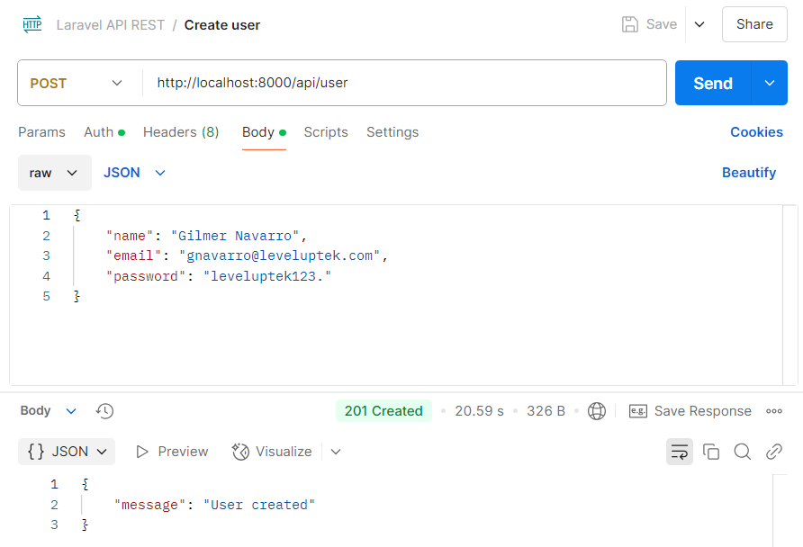

# LEVELUPTEK CHALLENGE
Challenge to develop a API REST with Laravel

## Stack
- **Programming language:** PHP V8.4
- **Framework:** Laravel - The PHP Framework for Web Artisans
- **Databases:** PostgreSQL and Redis
- **Others:** Docker

## Requeriments
- [Docker](https://www.docker.com)
- [Docker Compose](https://docs.docker.com/compose)

## Run application

1. Copy **.env.example** file to create **.env** file and edit database connection variables if you think it is necessary.
    * DB_DATABASE: Database's name.
    * DB_USERNAME: User to connect with database.
    * DB_PASSWORD: User's password to connect with database.

2. Build image
```bash
docker compose build --no-cache
```

3. Start Containers
```bash
docker compose up -d
```

4. Install dependencies *(only the first time)*
```bash
docker compose exec app composer install
```

5. Execute migrations *(only the first time)*
```bash
docker compose exec app php artisan migrate
```

6. Execute user seed *(only the first time)*
```bash
docker compose exec app php artisan db:seed --class=UserSeeder
```

## Use application

For use the application you must use the host http://localhost:8000 and the default credentials or create a new user for generate a token.
If you use Postman you could import ***Laravel API REST.postman_collection.json*** for get endpoints and use it.

### Default credentials

- **user:** iflores@leveluptek.com
- **password:** leveluptek123.

### Endpoints

#### Create user
Allow to create a new user for create a token and use it in other endpoints.

```bash
curl --location 'http://localhost:8000/api/user' \
--header 'Content-Type: application/json' \
--data-raw '{
    "name": <NEW_USER_NAME>,
    "email": <NEW_USER_EMAIL>,
    "password": <NEW_USER_PASSWORD>
}'
```



#### Login
Allow to get bearer token for use other endpoints

```bash
curl --location 'http://localhost:8000/api/login' \
--header 'Content-Type: application/json' \
--data-raw '{
    "email": "<USER>",
    "password": "<PASSWORD>"
}'
```


#### Logout
Allow to revoke token to close sesión. *(You must need bearer token to use it)*

```bash
curl --location --request POST 'http://localhost:8000/api/logout' \
--header 'Authorization: Bearer <TOKEN>' \
--data ''
```


#### Get character
Allow to get a character. *(You must need bearer token to use it)*

```bash
curl --location 'http://localhost:8000/api/characters/<CHARACTER_ID>' \
--header 'Authorization: <TOKEN>' \
--data ''
```


#### Get planet
Allow to get a planet. *(You must need bearer token to use it)*

```bash
curl --location 'http://localhost:8000/api/planets/<PLANET_ID>' \
--header 'Authorization: <TOKEN>' \
--data ''
```


#### Get film
Allow to get a film. *(You must need bearer token to use it)*

```bash
curl --location 'http://localhost:8000/api/films/<FILM_ID>' \
--header 'Authorization: <TOKEN>' \
--data ''
```


#### Get visits
Allow to get a list of all endpoints that user visited, if you want to get list of other page
only you need to change o add the query param page for it. *(You must need bearer token to use it)*.

```bash
curl --location 'http://localhost:8000/api/visits?page=<PAGE_NUMBER>' \
--header 'Authorization: <TOKEN>' \
--data ''
```


### Testing

If you want to run the test, you must to execute the next command:

```bash
docker compose exec app php artisan test
```

